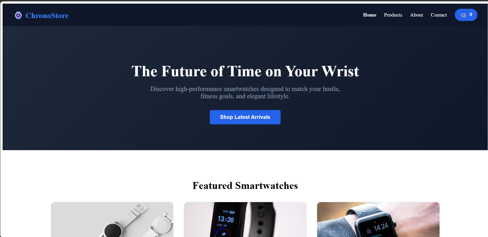
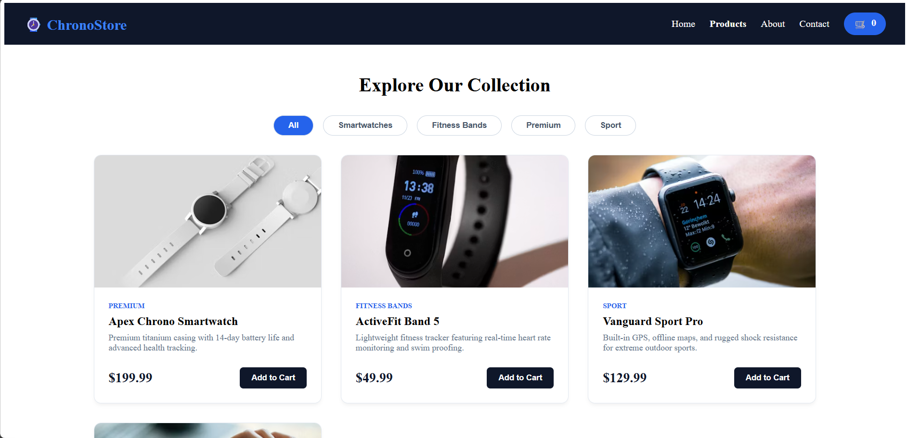
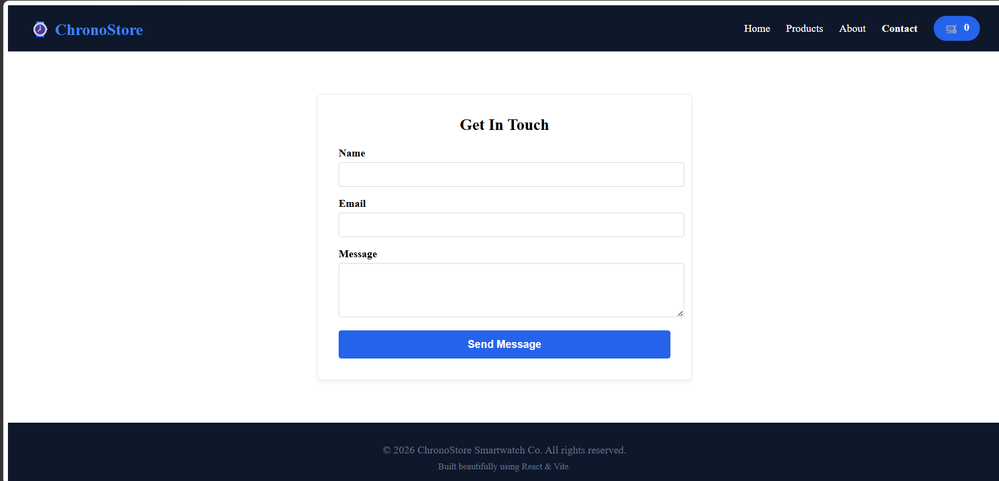

# ⚡ Storm-Shop (Smartwatch Store)

An elegant, modern, and fully responsive E-commerce web application built for browsing and purchasing premium smartwatches. 

---
<p align="center">
  
</p>
<p align="center">
  
</p>
<p align="center">
  
</p>

## 🚀 Features

- **Dynamic Product Showcase:** Browse through a curated catalog of high-end smartwatches.
- **Categorized Browsing:** Filter or view smartwatches based on specific collections and categories.
- **Detailed Product Cards:** Clean UI cards highlighting pricing, ratings, and features.
- **Testimonials Section:** Integrated customer review components for social proof.
- **Fully Responsive Design:** Seamless user experience across desktops, tablets, and smartphones.

---

## 🛠️ Tech Stack

- **Frontend:** React.js (functional components & hooks)
- **Build Tool:** Vite (for lightning-fast development and bundling)
- **Styling:** CSS3 / Vanilla CSS
- **Linting:** ESLint

---

## 📦 Project Structure

```text
smartwatch-store/
├── public/          # Static assets (favicons, global icons)
├── src/
│   ├── assets/      # Images (hero graphics, product images)
│   ├── components/  # Reusable UI parts (Navbar, Footer, ProductCard, etc.)
│   ├── data/        # Mock database file (products.js)
│   ├── pages/       # Distinct page views (Home, Products, About, Contact)
│   ├── App.jsx      # Main application routing & structure
│   └── main.jsx     # App entry point
